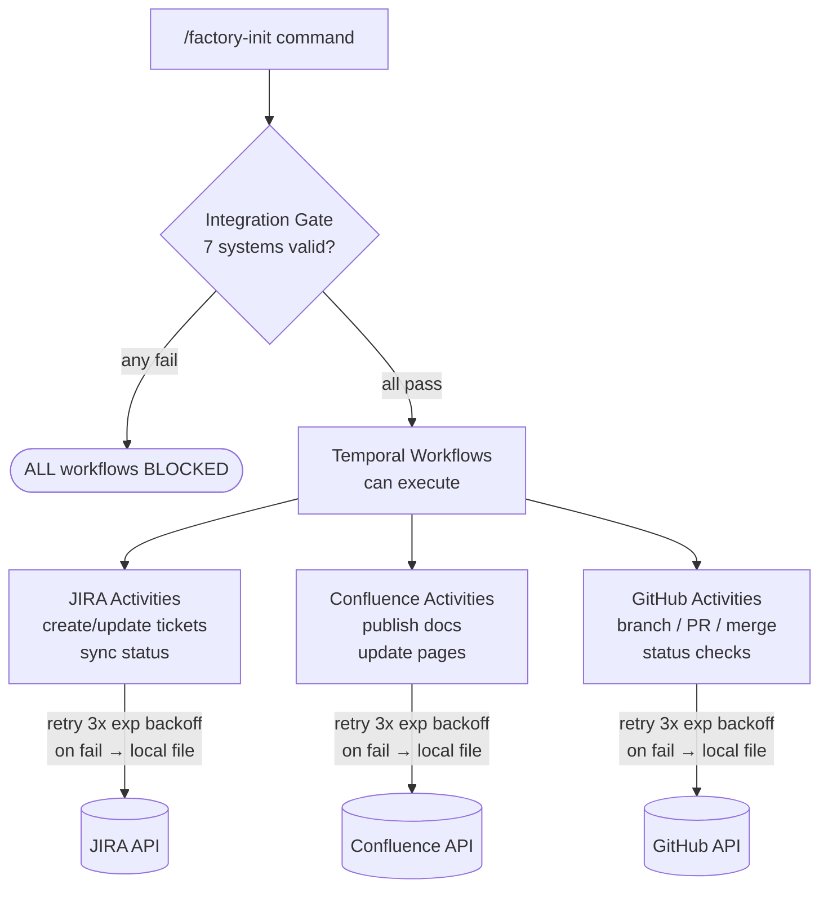
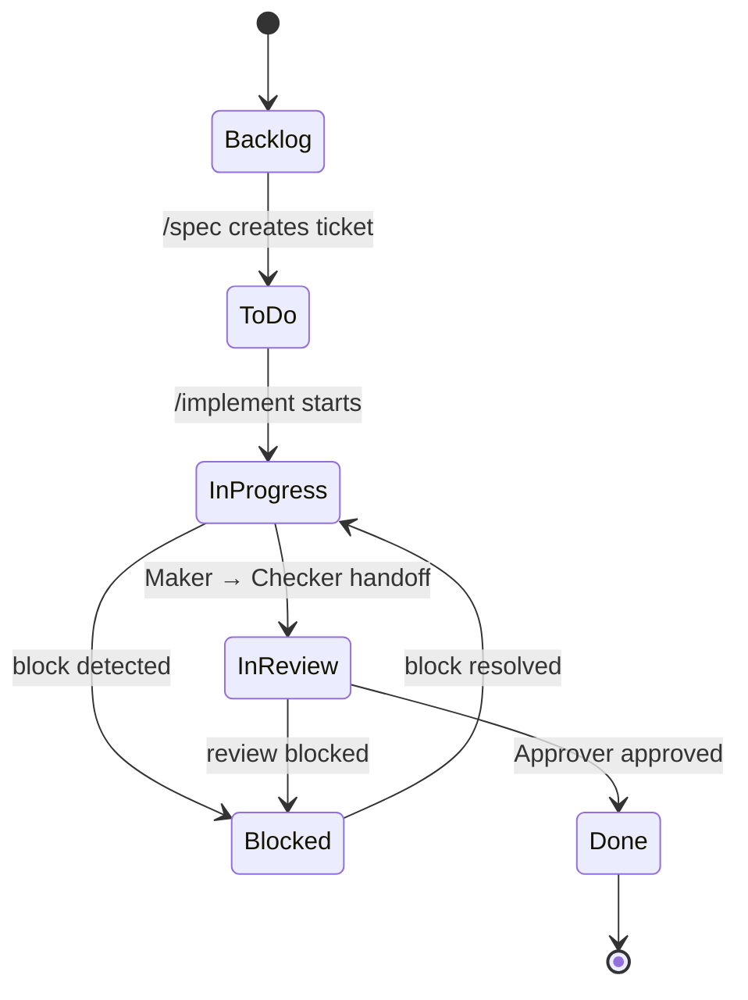

# JIRA, Confluence, and GitHub Integration Model

Integration gate is mandatory. 7 required systems must validate. No integration, no execution.



## Architecture

```
React UI → FastAPI → Postgres → Temporal → Integration Activities → External APIs
```

All product state lives in the PRODUCT REPO. Factory has templates only.

## The 7 Required Systems

1. **GitHub** — source control, branches, PRs
2. **JIRA** — work tracking, tickets, sprints
3. **Confluence** — documentation, knowledge hub
4. **CI/CD** — pipeline execution, test results
5. **Notifications** — alerts, escalations
6. **Monitoring** — health checks, metrics
7. **Auth** — authentication, authorization

All 7 validated during `/factory-init`. Any failure blocks execution.

## GitHub Integration

### Setup
Repo created via API during `/bootstrap-product`. Validated during `/factory-init`.

### Branch Model
Branch per ticket. Pattern: `{type}/{ticket-id}-{short-description}`

Types: `feature/`, `bugfix/`, `hotfix/`, `refactor/`, `test/`, `docs/`

### PR Model
PR per story. One story = one branch = one PR.

PRs created by Temporal activities with:
- Ticket reference and description
- File change summary
- Acceptance criteria checklist
- Test evidence (unit, integration, E2E, coverage)
- Governance chain results (checker, reviewer, security, approver)

### Sync
Temporal activities manage all GitHub operations:
- Branch creation/deletion
- PR creation/update/merge
- Status checks
- Review requests

## JIRA Integration

### Setup
Project created via API during `/bootstrap-product`. Validated during `/factory-init`.

### Hierarchy
```
Project → Epic (module) → Story (feature) → Task/Subtask (implementation)
```

### Ticket Lifecycle
Tickets created and updated by Temporal activities. Status synced at every stage transition.



```
Backlog → To Do → In Progress → In Review → Done
                    |               |
                    +-- Needs Info  +-- Blocked
```

Stage transitions:
- `/implement` starts → ticket moves to In Progress
- Maker hands to checker → ticket moves to In Review
- Approver approves → ticket moves to Done
- Any block detected → ticket moves to Blocked

### Sync
Temporal activities process all JIRA operations. State synced at every workflow stage transition. Failed syncs queued for retry.

## Confluence Integration

### Setup
Space and hub created via API during `/bootstrap-product`. Validated during `/factory-init`.

### Hub Structure
```
Product Hub
  ├── Overview (product description, team, status)
  ├── Architecture (overview + ADRs)
  ├── Modules (spec, data model, API contract per module)
  ├── Sprints (sprint reports)
  ├── Risks (risk register)
  ├── Decisions (decision log)
  └── Releases (release notes)
```

### Sync
Pages updated at phase boundaries by Temporal activities:
- Spec completed → module pages updated
- ADR created → architecture section updated
- Sprint completed → sprint report published
- Release deployed → release notes published

## Guided Setup

```bash
scripts/guided-setup.sh
```

Walks through each integration step by step. Interactive. Prompts for credentials, validates each, reports status.

## Validation

### Script Validation
```bash
scripts/validate-integrations.sh
```

Checks all 7 integrations via real API calls. Not mocked. Actual connectivity. Reports pass/fail per system.

### Runtime Validation
```
GET /api/v1/integrations/validate
```

Hit this endpoint anytime. Returns JSON with status of each integration. Used by UI dashboard. Used by Temporal workflows before execution.

### Validation During Factory Init
`/factory-init` runs full validation. All 7 systems must pass. Failure report shows exactly what failed and why.

## State Boundary

| Location | Contains |
|---|---|
| **Product Repo** | All product state: tickets, pages, branches, sync queues, mappings |
| **Factory** | Templates only: issue templates, page templates, PR templates |

Factory never stores product data. Product repo is the source of truth for all integration state.

## Integration Failure Handling

Temporal activities handle all failure cases:
- **Retry**: 3 attempts with exponential backoff
- **Fallback**: Local file representation if external system unavailable
- **Queue**: Failed operations queued for later processing
- **Reconciliation**: When external system recovers, reconcile local vs remote state

Last-writer-wins for conflicts. Manual override available for ambiguous cases.

## Environment Variables

```env
# GitHub
GITHUB_TOKEN=your-token
GITHUB_ORG=your-org

# JIRA
JIRA_BASE_URL=https://your-org.atlassian.net
JIRA_API_TOKEN=your-token
JIRA_USER_EMAIL=your-email
JIRA_PROJECT_KEY=MYP

# Confluence
CONFLUENCE_BASE_URL=https://your-org.atlassian.net/wiki
CONFLUENCE_API_TOKEN=your-token
CONFLUENCE_SPACE_KEY=MYP
```

## Activity Monitor for Integration Operations

Every integration sync operation is tracked by the central Activity Monitor at `/api/v1/activities/`. This provides full visibility into all external system interactions:

- **Sync operations logged**: Every JIRA ticket create/update, Confluence page publish, GitHub branch/PR operation is recorded as a user activity in Postgres
- **Category breakdown**: Activities are categorized by integration type (jira_sync, confluence_sync, github_sync) for dashboard filtering
- **Failure tracking**: Failed sync operations appear in the activity timeline with error details, making it easy to diagnose integration issues without digging through logs
- **User timeline**: All integration actions triggered by a user (manual syncs, forced reconciliations) appear in their activity timeline

The Activity Monitor complements the existing retry and failure handling -- while the retry mechanism handles recovery, the Activity Monitor provides the audit trail of what happened and when.

No integration, no execution. Validate first. Execute second.
