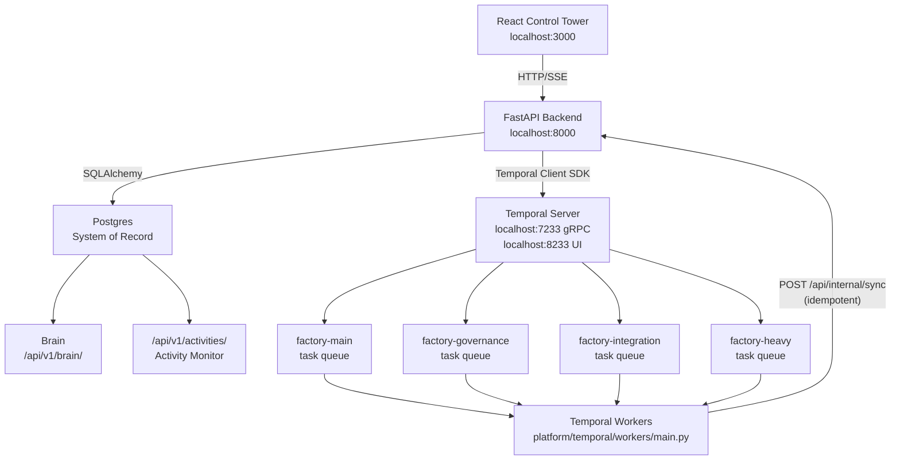
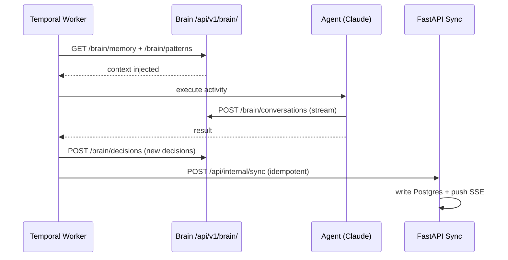

# 12 - Pipeline and Runtime Model



## Overview

Temporal IS the pipeline engine. There is no separate Dagster. There is no Redis queue. There are no file-based queues. Every piece of work in ProjectZeroFactory flows through Temporal workflows, with Postgres as the system of record and FastAPI as the API layer.

## Architecture

```
React (Control Tower)     localhost:3000
  |
  v
FastAPI (Backend API)     localhost:8000
  |
  v
Postgres (System of Record)
  |
  v
Temporal (Workflow Engine)  localhost:7233 (gRPC) / localhost:8233 (UI)
  |
  v
Workers (platform/temporal/workers/main.py)
```

That is it. No Dagster. No Redis. No `.claude/delivery/queue/` files. No `.claude/runtime/` state files.

## Temporal as Pipeline Engine

### Why Temporal Replaces Everything Else

Old model had Dagster for orchestration, Redis for queuing, FastAPI workers for execution, and file-based queues for tracking. Temporal replaces all of them:

| Old Component | What It Did | Temporal Replacement |
|---|---|---|
| Dagster | Orchestration, scheduling, DAGs | Temporal workflows with child workflows |
| Redis queues | Message passing between workers | Temporal task queues |
| FastAPI workers | Task execution | Temporal activities executed by workers |
| `.claude/delivery/queue/` files | Work item tracking | Postgres rows via FastAPI + Temporal workflow state |
| `.claude/runtime/` state files | Runtime state tracking | Temporal workflow state + Postgres |
| Cron jobs | Scheduled tasks | Temporal schedules (native) |

### Task Queue Model

Temporal task queues replace file-based queues. Work items are tracked in Postgres via FastAPI.

**How it works**:
1. A command (e.g., `/implement`) starts a Temporal workflow
2. The workflow dispatches activities to task queues
3. Workers registered in `platform/temporal/workers/main.py` pick up activities
4. Each activity is idempotent -- safe to retry
5. Activity results are persisted to Postgres via FastAPI calls
6. Temporal maintains workflow state for recovery and visibility

**Task queues in use**:
- `factory-main` -- primary queue for all factory workflows
- `factory-governance` -- governance chain activities (check, review, approve)
- `factory-integration` -- JIRA, Confluence, GitHub sync activities
- `factory-heavy` -- long-running activities (security scans, full test suites)

### Workers

All workers are registered in a single entry point:

```
platform/temporal/workers/main.py
```

This file registers all workflows and activities with the Temporal worker. When the platform starts, this worker connects to the Temporal server and begins polling task queues.

**What the worker registers**:
- All workflow classes (FeatureDevelopmentWorkflow, DeploymentReadinessWorkflow, etc.)
- All activity functions (create_jira_ticket, run_tests, sync_confluence, etc.)
- Task queue bindings

**Starting the worker**:
```bash
cd platform
python -m temporal.workers.main
```

The worker runs as part of the platform stack. When you start the platform (FastAPI + Temporal + Postgres), the worker starts automatically.

## State Management

### Postgres is the System of Record

Every meaningful state change is written to Postgres through FastAPI endpoints. Temporal syncs via idempotent activities -- meaning an activity can be retried without causing duplicate records or corrupted state.

**What Postgres tracks**:
- Product metadata (name, stack, status, phase)
- Feature/story records (ticket ID, status, module, assigned agent)
- Workflow execution records (workflow ID, type, status, started_at, completed_at)
- Governance chain results (checker, reviewer, approver outcomes per story)
- Integration sync state (last sync timestamps, sync status per system)
- Audit trail (who did what, when)

**Idempotent activity pattern**:
```python
@activity.defn
async def update_story_status(story_id: str, status: str) -> bool:
    """Update story status in Postgres. Idempotent -- safe to retry."""
    async with httpx.AsyncClient() as client:
        response = await client.put(
            f"{FASTAPI_URL}/api/stories/{story_id}/status",
            json={"status": status}
        )
        return response.status_code == 200
```

If Temporal retries this activity (due to a transient failure), the PUT request simply overwrites with the same value. No harm done.

### Temporal Workflow State

Temporal itself maintains workflow execution state. This gives you:
- **Exactly-once execution semantics**: Activities execute exactly once (or are safely retried)
- **Durable timers**: Sleep for hours or days without losing state
- **Signal handling**: External signals can modify running workflows
- **Query handling**: Query a running workflow for its current state
- **Automatic recovery**: If a worker crashes, another worker picks up where it left off

## Runtime Visibility

### Temporal UI

The Temporal UI runs at `localhost:8233` and provides:
- List of all running and completed workflows
- Workflow execution history (every activity, every state transition)
- Workflow input/output inspection
- Manual workflow termination or cancellation
- Search by workflow ID, type, or status
- Task queue monitoring (backlog depth, worker count)

This replaces the old `.claude/runtime/` state files and pipeline monitoring.

### React Control Tower

The React frontend at `localhost:3000` provides:
- Product dashboard (current phase, progress)
- Feature board (stories by status)
- Workflow status (active Temporal workflows)
- Integration health (JIRA, Confluence, GitHub, Temporal connection status)
- Governance chain visibility (which stories are in check/review/approve)
- Command execution (trigger commands from the UI)

### FastAPI Endpoints

The FastAPI backend at `localhost:8000` provides the API layer:

```
GET  /api/products                    # List products
GET  /api/products/{id}               # Product details
GET  /api/stories                     # List stories (filterable)
GET  /api/stories/{id}                # Story details with governance state
GET  /api/workflows                   # List workflow executions
GET  /api/workflows/{id}              # Workflow details
POST /api/commands/{command}          # Trigger a command
GET  /api/integrations/health         # Integration health check
GET  /api/health                      # System health
```

## Scheduling, Retries, and Timeouts

Temporal handles all of this natively. No external cron. No custom retry logic.

### Retries

Activities have retry policies defined in workflow code:

```python
retry_policy = RetryPolicy(
    initial_interval=timedelta(seconds=1),
    backoff_coefficient=2.0,
    maximum_interval=timedelta(minutes=5),
    maximum_attempts=5,
    non_retryable_error_types=["ValidationError", "AuthorizationError"],
)
```

### Timeouts

Workflows and activities have timeouts:

```python
# Workflow-level timeout
workflow_execution_timeout = timedelta(hours=24)

# Activity-level timeouts
activity_start_to_close_timeout = timedelta(minutes=10)
activity_schedule_to_close_timeout = timedelta(minutes=30)
activity_heartbeat_timeout = timedelta(minutes=2)
```

### Signals

External events can modify running workflows via Temporal signals:

```python
# Signal a running workflow to pause
await client.get_workflow_handle(workflow_id).signal("pause")

# Signal approval from the UI
await client.get_workflow_handle(workflow_id).signal("approve", {"approved": True})
```

### Schedules

Temporal handles recurring work via native schedules:

```python
# Schedule a nightly health check
await client.create_schedule(
    "nightly-health-check",
    Schedule(
        action=ScheduleActionStartWorkflow(
            HealthCheckWorkflow.run,
            id="health-check",
            task_queue="factory-main",
        ),
        spec=ScheduleSpec(cron_expressions=["0 2 * * *"]),
    ),
)
```

## What Was Removed

The following are no longer part of the system:

- **Dagster**: No `DAGSTER_HOME`, no `dagster dev`, no pipeline definitions in `.claude/pipelines/`
- **Redis**: No `REDIS_URL`, no message queues, no cache layer
- **File-based queues**: No `.claude/delivery/queue/` directories (ready, active, completed, failed, blocked)
- **Runtime state files**: No `.claude/runtime/` directory (workers, pipelines, scheduler, health.json)
- **FastAPI task workers**: No `POST /tasks/execute` worker endpoints. FastAPI is the API layer only -- Temporal workers execute tasks.
- **Pipeline mode toggle**: No `ENABLE_PIPELINE_MODE` flag. Temporal is always on. There is no "interactive vs pipeline" distinction -- everything is a workflow.

## Starting the Platform

```bash
# Start all services (Temporal, Postgres, FastAPI, React)
cd platform
docker compose up -d

# Or start individually:
# Temporal server
temporal server start-dev --ui-port 8233

# Postgres (via Docker or local)
docker compose up postgres -d

# FastAPI backend
cd platform/backend
uvicorn main:app --reload --port 8000

# Temporal workers
cd platform
python -m temporal.workers.main

# React frontend
cd platform/frontend
npm run dev
```

## Monitoring

```
/monitor --pipeline
```

Shows:
- Active Temporal workflows (count, types, durations)
- Task queue depth per queue
- Worker health (connected workers, last heartbeat)
- Failed workflows requiring attention
- Postgres connection health
- Integration sync status

All of this data comes from the Temporal API and Postgres. No separate monitoring infrastructure needed for the factory itself.

## Brain as Runtime Component



The Brain (`/api/v1/brain/`) is a core runtime component that sits between Postgres and the agents. It provides persistent memory that agents read before every action and write after every completion.

**Runtime role**:
- Agents query `/api/v1/brain/memory` and `/api/v1/brain/patterns` before executing any activity
- Agents write to `/api/v1/brain/decisions` and `/api/v1/brain/conversations` during and after execution
- The Brain is accessed via FastAPI -- it is not a separate service, but a set of endpoints backed by dedicated Postgres tables

**In the runtime stack**:
```
Temporal Worker → Activity executes → Brain read (via FastAPI) → Agent runs → Brain write (via FastAPI) → Sync to Postgres
```

The Brain does not replace Temporal workflow state. Temporal owns execution state (what step are we on, what retried, what failed). Brain owns knowledge state (what do we know, what was decided, what patterns work).

## Activity Monitor: Observability Layer

The Activity Monitor at `/api/v1/activities/` is the central user activity tracking system. It provides an observability layer over all user and system actions.

**What gets logged**:
- Workflow starts and completions (which command, which product, which user)
- Approval actions (approve, reject, with context)
- Command executions from the UI or CLI
- Navigation events (dashboard views, detail inspections)
- System events (integration status changes, errors, deployments)

**Endpoints**:

| Endpoint | Purpose |
|---|---|
| `GET /api/v1/activities/` | List activities with filters (user, category, date range) |
| `GET /api/v1/activities/summary` | Activity summary dashboard with category breakdown |
| `GET /api/v1/activities/timeline/{user_id}` | User-specific timeline view |

**How it fits**:
- The Activity Monitor is passive -- it logs, it does not block or gate
- It complements Temporal UI (which shows workflow internals) by showing user-level actions
- It feeds into the React Control Tower dashboard for operational visibility
- System events (integration failures, deployment triggers) are automatically logged
